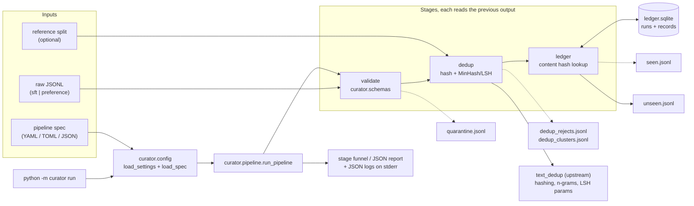

Forked from https://github.com/ChenghaoMou/text-dedup.

# DataSieve

Validate and deduplicate LLM training data (SFT and preference records) from one declarative
pipeline spec, on CPU, with no API keys. DataSieve is a fork of
[ChenghaoMou/text-dedup](https://github.com/ChenghaoMou/text-dedup): the upstream `text_dedup`
package is kept intact and reused for MinHash/LSH, and everything the fork adds lives in the new
`curator` package next to it.

```text
$ make demo
pipeline sft-demo-300: examples/data/sft_demo.jsonl -> .curator/sft-demo-300/unseen.jsonl
  validate      299 in ->    287 out   (12 quarantined: blank_text=2, consecutive_same_role=1, ...)
  dedup         287 in ->    220 out   (67 dropped: contaminated=12, exact_duplicate=30, near_duplicate=25)
  ledger        220 in ->    220 out   (0 skipped)
finished in 0.08s (3,567 records/s)
```

## What I built on top

Everything below is fork work (`git log --author=vipul21435@iiitd.ac.in`); `src/text_dedup/`,
`benchmarks/` and `report/` are upstream code.

- **Typed configuration** (`curator.config`): `CURATOR_*` settings via pydantic-settings and a
  YAML/TOML/JSON pipeline spec in which unknown keys, duplicate keys and typos are errors, with
  relative paths resolved against the spec file.
- **Strict record schemas** (`curator.schemas`): SFT in chat or prompt/response form and
  preference (chosen/rejected) pairs, with stable machine-readable reason codes and
  content-derived ids for records that have none.
- **The `validate` stage** (`curator.stages.validate`): every input line ends up in the output or
  in a quarantine file with all of its reasons; an invalid-fraction threshold fails the run
  before a half-good dataset flows downstream; outputs are atomic and byte-identical on re-run.
- **The `dedup` stage** (`curator.stages.dedup`, `curator.dedup`): exact dedup by content hash of
  normalised text, near-duplicate clustering with MinHash/LSH (seeded, keep-first, every
  candidate verified with the exact Jaccard similarity) and a contamination check against an
  evaluation split; rejects carry the reason, the matched id and the similarity.
- **The `ledger` stage and run ledger** (`curator.stages.ledger`, `curator.ledger`): a SQLite file
  that records every delivered content hash with its run id, spec digest and input; a re-run of
  the same input is byte-identical, a later batch skips what earlier batches delivered (reported
  as `seen` with the earlier run id), and `python -m curator ledger stats|collisions` lists the
  runs and the ids or contents that disagree across batches.
- **PII and secret detectors** (`curator.pii`): a library, usable on its own like `curator.dedup`,
  with detectors for emails, phone numbers, IPv4/IPv6, Luhn-checked card numbers and API keys or
  tokens (known prefixes plus long high-entropy tokens); `detect()` resolves overlapping spans by
  priority and `scrub()` replaces each one with a typed placeholder such as `[EMAIL]` and counts
  detections per kind. False-positive guards (version strings, times, MAC addresses, hex digests,
  UUIDs, numbers that fail Luhn, separator-free digit runs) are pinned by seeded tests. The
  `scrub` pipeline stage that composes it is the next slice.

  ```python
  from curator.pii import scrub
  result = scrub("mail a@b.io, key sk-abcdefghijklmnopqrstuv, host 10.0.0.1")
  result.text    # 'mail [EMAIL], key [API_KEY], host [IPV4]'
  result.counts  # {'email': 1, 'api_key': 1, 'ipv4': 1}
  ```
- **A pipeline runner and CLI** (`curator.pipeline`, `curator.cli`): stages chain through the
  run directory and `python -m curator run` prints the stage funnel or a JSON report.
- **Structured logging and an error hierarchy** (`curator.log`, `curator.errors`): JSON log lines
  with bound context, and `CuratorError` subclasses with stable codes and `sysexits` exit codes.
- **Packaging and delivery**: a seeded 299-record demo dataset with planted defects, a Makefile,
  a digest-pinned non-root Docker image with a compose file, and CI that lints, type-checks,
  tests on Python 3.12 and 3.13, checks the wheel and builds the image.

## Architecture



## Quickstart

Five commands from a fresh clone; needs Python 3.12 and [uv](https://docs.astral.sh/uv/):

```bash
git clone https://github.com/vipul21435/datasieve.git
cd datasieve
uv sync
make demo
make test
```

`make demo` validates and deduplicates the bundled sample (see the output above), writes the
kept records, the quarantine file, the rejects, the clusters and the ledger's seen report to
`.curator/sft-demo-300/`, and records the run in `.curator/ledger.sqlite`; run it twice and the
ledger line reads `220 in -> 220 out (0 skipped)` again, while the `--json` report and the
`ledger.finished` log line count every record as a re-run (`rerun: 220`).
`make test` runs the unit tests and doctests with coverage (the count and timing are under
Benchmarks). `make help` lists the rest (`lint`, `typecheck`, `ci`, `clean`).

## CLI reference

```text
python -m curator run   SPEC [--work-dir DIR] [--json] [--log-level LEVEL] [--log-format json|text]
python -m curator check SPEC                  [--log-level LEVEL] [--log-format json|text]
python -m curator ledger stats|collisions     [--ledger FILE] [--work-dir DIR] [--json]
python -m curator --version
```

| Command | What it does |
| --- | --- |
| `run SPEC` | Runs every stage of the spec in order and prints the stage funnel to stdout. `--json` prints the full report instead (`PipelineReport.to_dict()` plus `elapsed_seconds` and `records_per_second`). `--work-dir` overrides `CURATOR_WORK_DIR`. |
| `check SPEC` | Loads and validates the spec, prints its input and stages, runs nothing. |
| `ledger stats` | Lists the ledger's totals and every run with its in/kept/skipped/rerun counts. The ledger is `--ledger`, else `<work dir>/ledger.sqlite`; a missing one exits `66`. |
| `ledger collisions` | Lists ids recorded with more than one content and contents recorded under more than one id, with the run and line of each side. |

Logs go to stderr in the format chosen by `--log-format` or `CURATOR_LOG_FORMAT`. Exit codes:
`0` success, `2` usage error, `78` bad spec or settings (`ConfigError`), `65` unusable data
(`DataError`, including a quarantine threshold breach), `66` missing input file.

The same thing from Python:

```python
from curator.config import load_settings, load_spec
from curator.log import configure_logging
from curator.pipeline import run_pipeline

settings = load_settings()
configure_logging(settings.log_level, settings.log_format)
report = run_pipeline(load_spec("examples/sft-demo.yaml"), work_dir=settings.work_dir)
print(report.output_path, [stage.to_dict() for stage in report.stages])
```

## Pipeline spec reference

A run is one spec file. Unknown or duplicate keys are errors, relative paths resolve against the
spec's directory, and the first stage must be `validate` so later stages see typed records. Every
option with its default:

```yaml
version: 1
name: sft-demo-300                 # [a-z0-9._-]; names the output directory
description: ""
input:
  path: data/sft_demo.jsonl
  kind: sft                        # sft | preference
output:
  dir: null                        # default: <CURATOR_WORK_DIR>/<name>
stages:
  - stage: validate
    unknown_fields: reject         # reject | metadata (move unknown top-level keys into metadata)
    reject_duplicate_ids: true
    max_invalid_fraction: null     # e.g. 0.25: fail the run if more than 25% is quarantined
    output_file: validated.jsonl
    quarantine_file: quarantine.jsonl
  - stage: dedup
    fields: null                   # text fields to compare; default: all of the kind (sft: prompt, response)
    normalize:
      lowercase: true
      collapse_whitespace: true
      strip_punctuation: false
    hash: xxhash                   # xxhash | sha256, over the normalised text
    near:
      enabled: true
      num_perm: 128                # MinHash signature length
      ngram_size: 3                # word n-grams
      threshold: 0.8               # Jaccard similarity at or above which the later record is dropped
      seed: 42
    reference: null                # optional contamination check:
    #   path: data/eval.jsonl      #   records matching this split are dropped
    #   fields: null               #   default: the stage's fields
    #   threshold: null            #   default: near.threshold
    output_file: deduped.jsonl
    rejects_file: dedup_rejects.jsonl
    clusters_file: dedup_clusters.jsonl
  - stage: ledger
    path: null                     # default: <CURATOR_WORK_DIR>/ledger.sqlite, shared by every pipeline in it
    fields: null                   # text fields hashed as the record's content; default: all of the kind
    normalize: {lowercase: true, collapse_whitespace: true, strip_punctuation: false}
    hash: xxhash
    output_file: unseen.jsonl
    seen_file: seen.jsonl
```

**Records.** SFT accepts `{"messages": [{"role": ..., "content": ...}, ...]}` (user first,
assistant last, optional leading system turn) or `{"prompt", "response", "system"?}`; preference
accepts `{"prompt", "chosen", "rejected"}` in text or chat form, with optional scores. Both take an
optional `id` and a free-form `metadata` object. A record without an id gets a content-derived
one, so the chat and prompt/response forms of one example share an id.

**Validate.** Each non-blank line goes to `validated.jsonl` or to `quarantine.jsonl` with every
reason (`blank_text`, `missing`, `string_type`, `consecutive_same_role`, `duplicate_id`,
`invalid_json`, `duplicate_key`, `non_finite_number`, ...).

**Dedup.** The compared fields are normalised, joined and checked keep-first in this order:
`contaminated` (matches the reference split exactly or at the threshold), `exact_duplicate`
(content hash already kept), `near_duplicate` (a kept record's n-gram set is at least
`threshold` similar; LSH proposes candidates, the exact Jaccard similarity decides). Rejects and
clusters look like this:

```json
{"line": 3, "id": "sft-103", "reason": "near_duplicate", "match": "sft-101", "similarity": 0.928571, "record": {"id": "sft-103", "prompt": "...", "response": "..."}}
{"kept": "sft-101", "size": 4, "members": [{"id": "sft-102", "reason": "exact_duplicate", "similarity": 1.0}, {"id": "sft-103", "reason": "near_duplicate", "similarity": 0.928571}]}
```

**Ledger.** Each record's content hash (same normalisation and fields as `dedup`) is looked up in
the SQLite ledger. Unseen content is recorded under this run's id and kept. Content an earlier run
saw is written to `seen.jsonl` with that run's id, the id the content had there and its input:
it is kept when the earlier run read the same input bytes (a re-run, so `unseen.jsonl` is
byte-identical) and skipped when it came from a different input (an earlier batch). The ledger
keeps the first sighting of each `(content, id)` pair, so re-runs do not grow it, and nothing is
committed until the stage's files are written, so a failed run leaves it untouched. A run holds
the ledger's write lock from its first record to that commit, so pipelines that share a ledger take
turns: a run that starts while another is still writing waits 5 s for it, then fails with
`ledger_error` (exit 65), ledger untouched. Duplicates inside one input pass through: that is the
`dedup` stage's job.

```json
{"line": 2, "id": "c", "digest": "3487b07772598076a67584b6901893ce", "action": "skipped", "seen_run": "ledger-batch-1-20260928T223203Z-018ad048", "seen_id": "b", "seen_source": "examples/data/ledger_batch_1.jsonl"}
```

More examples: [`examples/sft-validate.yaml`](examples/sft-validate.yaml),
[`examples/preference-validate.toml`](examples/preference-validate.toml) and
[`examples/sft-dedup.yaml`](examples/sft-dedup.yaml) (ten records, every dedup reason once) and
[`examples/ledger-batch-1.yaml`](examples/ledger-batch-1.yaml) plus
[`examples/ledger-batch-2.yaml`](examples/ledger-batch-2.yaml) (two batches through one ledger,
both collision kinds; see the sample output below).

## Settings, logging and errors

| Variable | Default | Meaning |
| --- | --- | --- |
| `CURATOR_LOG_LEVEL` | `INFO` | Minimum log level |
| `CURATOR_LOG_FORMAT` | `json` | `json` (one object per line on stderr) or `text` |
| `CURATOR_WORK_DIR` | `.curator` | Output root; a spec without `output.dir` writes to `<work dir>/<name>` |

CLI flags override environment variables, which override a `.env` file (see
[`.env.example`](.env.example)), which overrides the defaults; an unknown `CURATOR_*` variable is
logged as a likely typo. With `json`, every log line is an event plus fields, with the pipeline
and stage bound as context:

```json
{"ts":"2026-09-28T21:50:11.520Z","level":"info","logger":"curator.stages.dedup","event":"dedup.finished","pipeline":"sft-demo-300","stage":"dedup","total":287,"kept":220,"dropped":67,"reasons":{"contaminated":12,"exact_duplicate":30,"near_duplicate":25},"groups":55}
```

Every deliberate failure is a `curator.errors.CuratorError` with a stable `code`, a `to_dict()`
for API bodies and logs, and an exit code from `sysexits.h` (see the CLI reference).

## Sample output

`python -m curator run examples/sft-demo.yaml --json --log-level WARNING` (paths shortened):

```json
{
  "pipeline": "sft-demo-300",
  "input": "examples/data/sft_demo.jsonl",
  "output": ".curator/sft-demo-300/unseen.jsonl",
  "stages": [
    {"stage": "validate", "total": 299, "valid": 287, "invalid": 12, "invalid_fraction": 0.040134,
     "reasons": {"blank_text": 2, "consecutive_same_role": 1, "duplicate_id": 1, "duplicate_key": 1,
                 "invalid_json": 2, "missing": 1, "non_finite_number": 1, "string_type": 2, "too_short": 1}},
    {"stage": "dedup", "total": 287, "kept": 220, "dropped": 67, "dropped_fraction": 0.233449,
     "reasons": {"contaminated": 12, "exact_duplicate": 30, "near_duplicate": 25},
     "groups": 55, "reference_size": 15},
    {"stage": "ledger", "ledger": ".curator/ledger.sqlite", "run_id": "sft-demo-300-20260928T222731Z-d53dfc20",
     "total": 220, "kept": 220, "dropped": 0, "dropped_fraction": 0.0, "reasons": {},
     "new": 0, "rerun": 220, "earlier_runs": {"sft-demo-300-20260928T222726Z-30506baa": 220}}
  ],
  "elapsed_seconds": 0.082412,
  "records_per_second": 3567.1
}
```

That was the second run, so the ledger stage saw every record before (`rerun: 220`) and names the
run that delivered it. The bundled two-batch example, where batch 2 reuses id `a` for new content
and re-sends batch 1's `b` under the id `c` (both runs share the work dir, hence the ledger):

```text
$ python -m curator run examples/ledger-batch-1.yaml --work-dir .curator/ledger-example --log-level ERROR
pipeline ledger-batch-1: examples/data/ledger_batch_1.jsonl -> .curator/ledger-example/ledger-batch-1/unseen.jsonl
  validate        2 in ->      2 out   (0 quarantined)
  ledger          2 in ->      2 out   (0 skipped)
finished in 0.01s (303 records/s)
$ python -m curator run examples/ledger-batch-2.yaml --work-dir .curator/ledger-example --log-level ERROR
pipeline ledger-batch-2: examples/data/ledger_batch_2.jsonl -> .curator/ledger-example/ledger-batch-2/unseen.jsonl
  validate        3 in ->      3 out   (0 quarantined)
  ledger          3 in ->      2 out   (1 skipped: seen=1)
finished in 0.01s (407 records/s)
$ python -m curator ledger stats --work-dir .curator/ledger-example
ledger .curator/ledger-example/ledger.sqlite: 2 runs, 5 records, 4 distinct contents, 4 distinct ids, 2 collisions
  ledger-batch-1-20260928T223203Z-018ad048  2026-09-28T22:32:03Z       2 in ->      2 kept (0 skipped, 0 rerun)  examples/data/ledger_batch_1.jsonl
  ledger-batch-2-20260928T223204Z-2c914cb5  2026-09-28T22:32:04Z       3 in ->      2 kept (1 skipped, 0 rerun)  examples/data/ledger_batch_2.jsonl
$ python -m curator ledger collisions --work-dir .curator/ledger-example
same id, different content: 1
  a: 119ebe881d3f06487d4d96a2f3fb14f7 (run ledger-batch-1-20260928T223203Z-018ad048, line 1), 08c7a44a30ae931920f27012c042f0e5 (run ledger-batch-2-20260928T223204Z-2c914cb5, line 1)
same content, different ids: 1
  3487b07772598076a67584b6901893ce: b (run ledger-batch-1-20260928T223203Z-018ad048, line 2), c (run ledger-batch-2-20260928T223204Z-2c914cb5, line 2)
```

The demo data is generated by [`examples/make_demo_data.py`](examples/make_demo_data.py) with a
fixed seed: 220 distinct records plus 30 exact copies (case or whitespace changes), 25 near copies
(one or two words changed), 12 copies of the 15-record evaluation split and 12 invalid rows. The
counts the pipeline reports are exactly the planted ones, and a test regenerates the files byte
for byte.

## Docker

```bash
docker build -t datasieve:dev .
docker run --rm datasieve:dev                                   # the demo pipeline
docker run --rm datasieve:dev --help
docker run --rm -v "$PWD/data:/data:ro" datasieve:dev run /data/my-spec.yaml
docker compose run --rm demo                                    # same, via docker-compose.yml
docker compose run --rm --entrypoint ls demo -l /home/curator/runs/sft-demo-300   # its output
```

The image is `python:3.12-slim` pinned by digest, runs as the non-root user `curator`, installs
only the runtime dependencies from `uv.lock` and does not build the optional Rust suffix-array
backend. It is `linux/amd64` only: the upstream dependency `polars-grouper` publishes x86_64
wheels but no aarch64 wheel, so an arm64 image would need a Rust toolchain; on Apple Silicon Docker
runs it under emulation, which is fine for the demo and small datasets.

Run output goes to `CURATOR_WORK_DIR`, which the image sets to `/home/curator/runs` and creates
owned by `curator`, so a volume mounted there (compose's named volume `runs`, or
`-v myruns:/home/curator/runs`) is writable by the non-root user. Compose also mounts `./data`
read-only at `/data` for your own specs and JSONL files.

## Design decisions and tradeoffs

- **Fork, do not vendor.** `text_dedup` stays a normal importable package and `curator` reuses its
  hashing, n-gram and LSH-parameter code. The cost is carrying upstream's dependency list
  (`datasets`, `polars`, `scipy`) in an image that only needs a fraction of it.
- **Spec file, not flags.** A pipeline is data (versioned, diffable, reviewable), and pydantic
  models with `extra="forbid"` make typos loud. The tradeoff is verbosity for one-off runs, which
  is why the CLI stays thin.
- **Validate first, always.** Later stages only ever see typed records, so they hold no defensive
  code, and the quarantine file makes every rejection auditable. A dataset that fails the
  invalid-fraction threshold produces no output file at all rather than a partial one.
- **Keep-first, exact-verified near dedup.** LSH proposes, Jaccard decides: the reported
  similarity is real, the seed fixes the clusters, and re-runs are byte-identical. The cost is a
  full n-gram comparison per candidate pair, and the usual LSH S-curve means a pair right at the
  threshold is found with only even odds, so thresholds should sit below the similarity to catch.
- **The ledger keeps first sightings, not history.** One row per `(content, id)` pair with the run
  that first saw it, plus one row per run with its counts, so the file stays small and a re-run
  is a no-op for it; the price is that the ledger cannot say which later runs re-saw a record
  beyond their totals. Identity for "same input" is the input file's bytes, not its path, so an
  edited or appended file counts as a new batch and only its new content is delivered.
- **Streaming, single process.** Records stream line by line and only the index lives in memory,
  so a laptop handles millions of short records; there is no multi-process path yet.
- **Stable codes everywhere.** Reason codes, error codes, exit codes and log event names are part
  of the interface and covered by tests, so shell pipelines and dashboards can branch on them.

## Benchmarks

Measured on this machine on 2026-09-29: Apple Silicon Mac (M2, 8 cores, 8 GB RAM), Python 3.12,
`uv run python -m curator run <spec> --log-level ERROR`, wall-clock as reported by the CLI. Each
row is one `validate -> dedup` run (`num_perm=128`, 3-grams, threshold 0.8); the 22k set was
generated with the demo generator's templates (2,000 planted copies) and, because the templates
share most of their words, the near-duplicate count exceeds the planted one.

| Dataset | Records in | Kept | Runs | Wall-clock | Throughput |
| --- | --- | --- | --- | --- | --- |
| `examples/sft-demo.yaml`, validate + dedup only | 299 | 220 | 3 | 0.060-0.065 s | 4,600-5,000 records/s |
| `examples/sft-demo.yaml` with the ledger stage (re-run) | 299 | 220 | 6 | 0.08-0.09 s | 3,300-3,700 records/s |
| 22k templated SFT records, validate + dedup (not bundled) | 22,000 | 18,512 | 3 | 4.0-5.7 s | 3,800-5,500 records/s |

The 9-10 ms the ledger stage takes for the demo's 220 records by the log timestamps
(`dedup.finished` to `ledger.finished`, about 22,000 records/s including the SQLite commit and
fsync) is the stage loop only; the first run over a fresh ledger and a re-run cost the same. The
pipeline-level cost of the stage is the gap between the two demo rows, 15-30 ms, because it also
pays the SQLite import, the digest of the input bytes and the connection open plus schema check.
`make demo` end to end (including interpreter start-up) takes 0.59-0.74 s (`/usr/bin/time -p`,
6 runs); a second machine under load measured every number here about 1.5x slower, so treat them
as an idle-machine floor. The 22k runs overlapped a Docker image build on the same machine, hence
the spread. Full test suite: 763 tests in about 4-17 s with coverage, 86% line coverage
(`make test`).

## What I would do next

- A `--since RUN` option for `ledger stats` and a `ledger runs --prune` command, so a ledger that
  outlives its batches can be trimmed.
- A `scrub` stage over `curator.pii` with scrub (rewrite in place) and quarantine modes, per-detector
  counts in the funnel and reason codes, and planted PII in the demo dataset.
- A quality validator registry (length bounds, language, refusal and boilerplate detection) that
  specs can compose per field.
- A seeded synthetic data generator behind the same schemas, so a pipeline can be exercised at any
  size, plus a report and dataset card written next to the output.
- A Typer CLI with rich progress and a FastAPI job service that runs specs asynchronously and
  serves the reports.
- Hermetic CI (no PyPI access after `uv sync --frozen`) and property-based tests with `hypothesis`
  for the normaliser and the schemas.

## Development

```bash
make install     # uv sync
make lint        # ruff check + ruff format --check
make typecheck   # mypy over src/ (stricter for curator.*)
make test        # pytest with coverage: tests/ plus src doctests
make ci          # lint, typecheck, test
uv run pre-commit install   # optional hygiene hooks; the upstream justfile is also kept
```

`text_dedup.suffix_array` shells out to Google's
[deduplicate-text-datasets](https://github.com/google-research/deduplicate-text-datasets) (Rust,
git submodule under `third_party/`). Nothing in the curation pipeline or the tests needs it; to
enable it run `git submodule update --init third_party/deduplicate-text-datasets` and install a
Rust toolchain. Ruff, mypy and pytest never enter `third_party/`.

## Repository layout

| Path | Contents | Origin |
| --- | --- | --- |
| `src/curator/` | `cli.py`, `pipeline.py`, `ledger.py`, `config/`, `schemas/`, `stages/`, `dedup/`, `pii/`, `io/`, `errors.py`, `log.py` | this fork |
| `examples/` | Pipeline specs, the seeded demo generator and sample datasets with planted defects | this fork |
| `Makefile`, `Dockerfile`, `docker-compose.yml`, `.github/workflows/main.yml` | Developer entry points, runtime image, CI | this fork (CI extended from upstream) |
| `src/text_dedup/` | MinHash, SimHash, Bloom filter and suffix-array dedup | upstream text-dedup |
| `benchmarks/`, `report/`, `configs/`, `justfile` | Upstream benchmark harness, report app and configs | upstream text-dedup |
| `third_party/deduplicate-text-datasets` | Optional Rust suffix-array backend (git submodule) | Google Research |

Both `curator` and `text_dedup` ship in the single `sft-data-curator` wheel.

## License and credits

Apache 2.0, see [LICENSE](LICENSE); the upstream copyright is kept. `text_dedup`, the benchmarks
and the report app are the work of Chenghao Mou and the text-dedup contributors, whose
[README](https://github.com/ChenghaoMou/text-dedup#readme) and
[documentation](https://chenghaomou.github.io/text-dedup/) describe the upstream algorithms and
their own benchmark results. Cite upstream when you use the deduplication algorithms:

```bibtex
@software{chenghao_mou_2023_8364980,
  author       = {Chenghao Mou and
                  Chris Ha and
                  Kenneth Enevoldsen and
                  Peiyuan Liu},
  title        = {ChenghaoMou/text-dedup: Reference Snapshot},
  month        = sep,
  year         = 2023,
  publisher    = {Zenodo},
  version      = {2023.09.20},
  doi          = {10.5281/zenodo.8364980},
  url          = {https://doi.org/10.5281/zenodo.8364980}
}
```

Upstream acknowledges [Datasketch](https://github.com/ekzhu/datasketch) (MIT),
[simhash-py](https://github.com/seomoz/simhash-py) and [simhash-cpp](https://github.com/seomoz/simhash-cpp)
(MIT), [deduplicate-text-datasets](https://github.com/google-research/deduplicate-text-datasets)
(Apache 2.0) and [Gaoya](https://github.com/serega/gaoya) (MIT).
